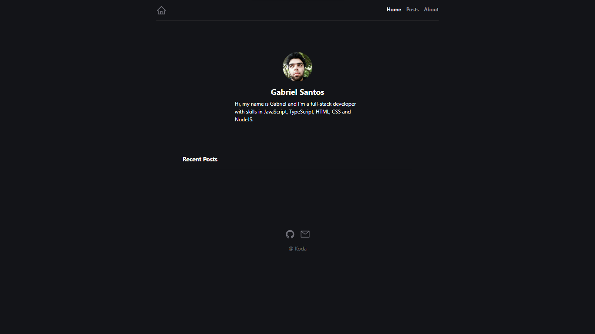

# Personal Blog

# Personal Blog

I created this blog to post about the programming languages and frameworks that I am learning, as well as other topics such as IDEs, terminals, operating systems, and more.

